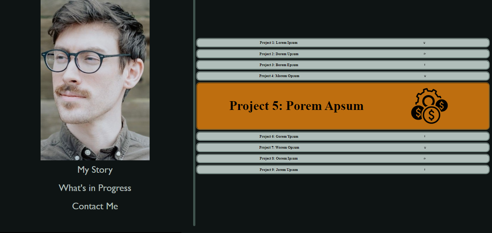

## WELCOME:
This is the README.md for the Challenge TWO "my work portfolio" for the UT Coding Bootcamp.

This is a website featuring all the projects I've completed. It showcases:

* HTML
* CSS
* and mock up sites where my completed projects will *eventually* go

## VERSATILITY
Full-stack development!

## HOW TO:
Visit the link and read about me on either Desktop or a mobile device.

## VISIT:
You can view the website hosted from GitHub by visiting the link:

[Click here to check it out](https://lawhornmatt.github.io/Ch2_MyPortfolio/)

## SCREENSHOT:

## CREDIT:
Matthew Lawhorn, July 2022
